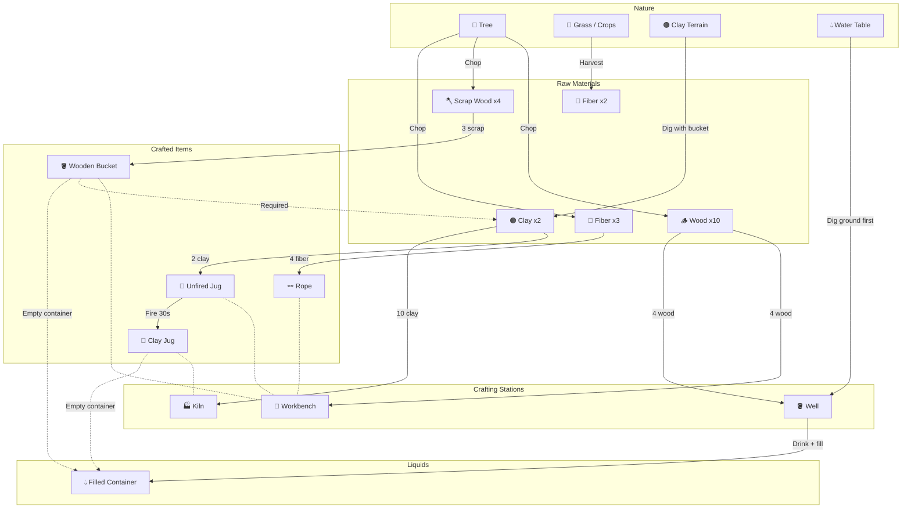

# Crafting & Resource Chain

## Progression Overview

## Resource Sources

| Resource | Source | Method |
|----------|--------|--------|
| Wood | Trees | Chop (3.5s) |
| Scrap Wood | Trees | Chop (byproduct) |
| Fiber | Trees, Crops | Chop / Harvest |
| Clay | Clay terrain | Dig (shovel = +2 yield) |
| Berries | Berry bushes, Crops | Harvest |
| Rock | Rock blocks | Pick up |
| Water | Wells | Drink action (4s) |

## Crafting Recipes

### Workbench

| Recipe | Inputs | Output | Time |
|--------|--------|--------|------|
| Stone Axe | 2 Rock + 1 Wood | 1 Stone Axe | 6s |
| Wooden Shovel | 2 Scrap Wood + 1 Wood | 1 Shovel | 5s |
| Stone Pick | 2 Rock + 1 Scrap Wood | 1 Stone Pick | 6s |
| Rope | 4 Fiber | 1 Rope | 5s |
| Wooden Bucket | 3 Scrap Wood | 1 Bucket | 8s |
| Unfired Jug | 2 Clay | 1 Unfired Jug | 6s |

### Kiln

| Recipe | Inputs | Output | Time |
|--------|--------|--------|------|
| Clay Jug | 1 Unfired Jug | 1 Clay Jug | 30s |

## Building Costs

| Structure | Materials | Build Time |
|-----------|-----------|------------|
| Workbench | 4 Wood | 3s |
| Kiln | 10 Clay | 8s |
| Well | 4 Wood (on dug ground) | 8s |
| Wood Wall | 3 Wood | 3s |
| Wood Floor | 2 Wood | 1.5s |
| Bench | 2 Wood | 2s |
| Bed | 2 Wood | 2s |

## Progression Path

1. **Immediate survival** — Eat berries from bushes, drink at rivers
2. **Tool making** — Chop trees → craft bucket + rope at workbench
3. **Water independence** — Dig well on wet ground → plebs auto-drink
4. **Clay gathering** — Find clay terrain, dig with bucket → clay drops
5. **Pottery** — Build kiln (10 clay) → fire unfired jugs into clay jugs
6. **Portable water** — Fill jugs at well → store water away from wells
