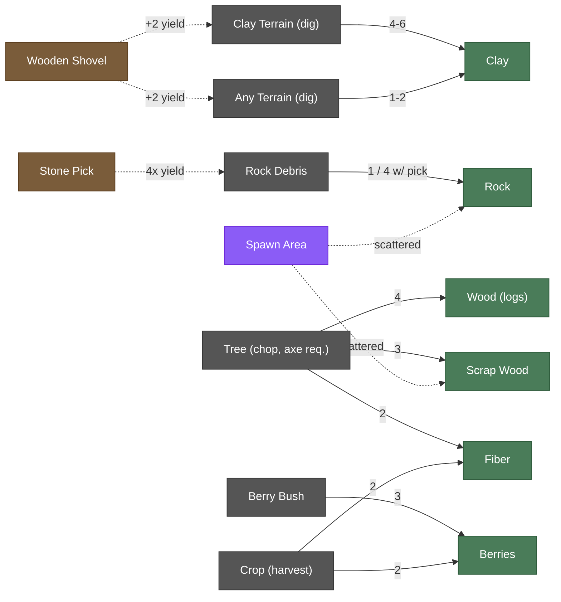
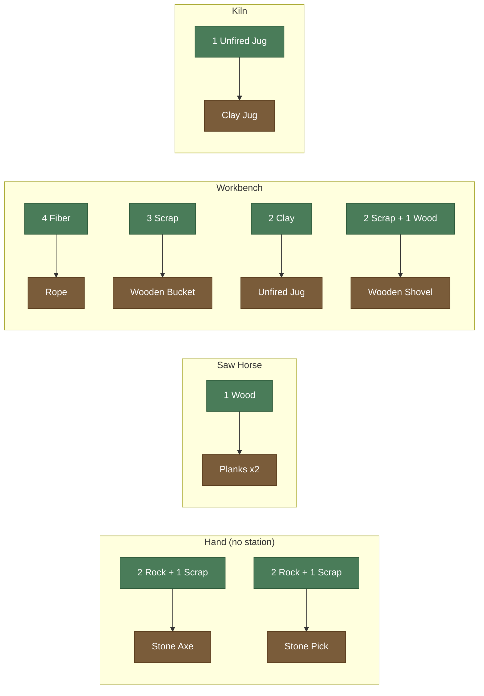
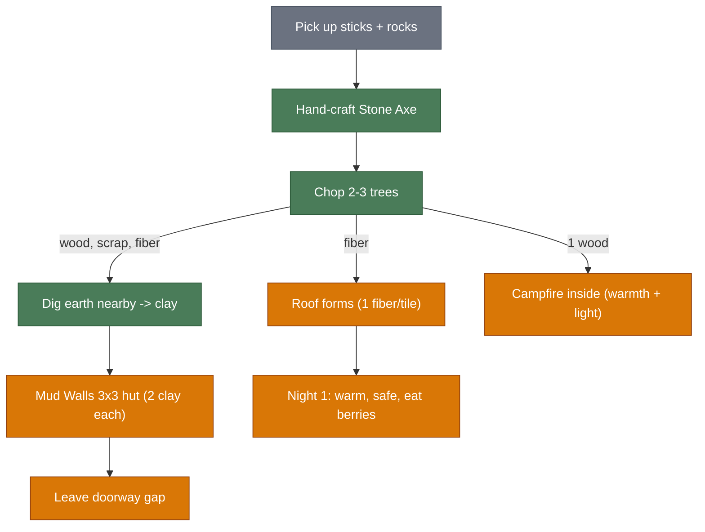
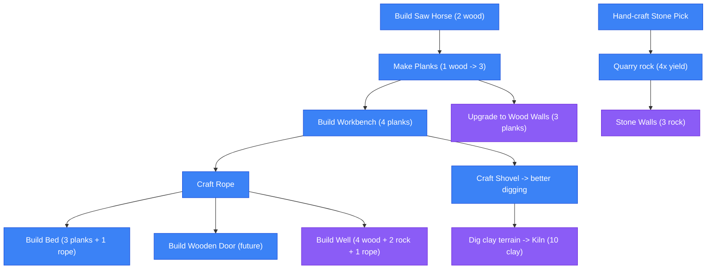
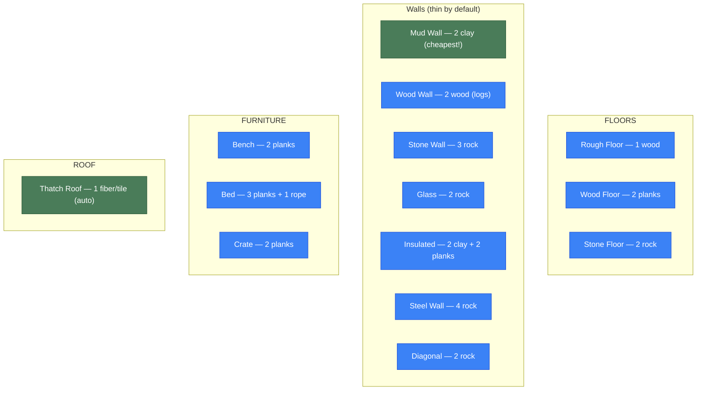
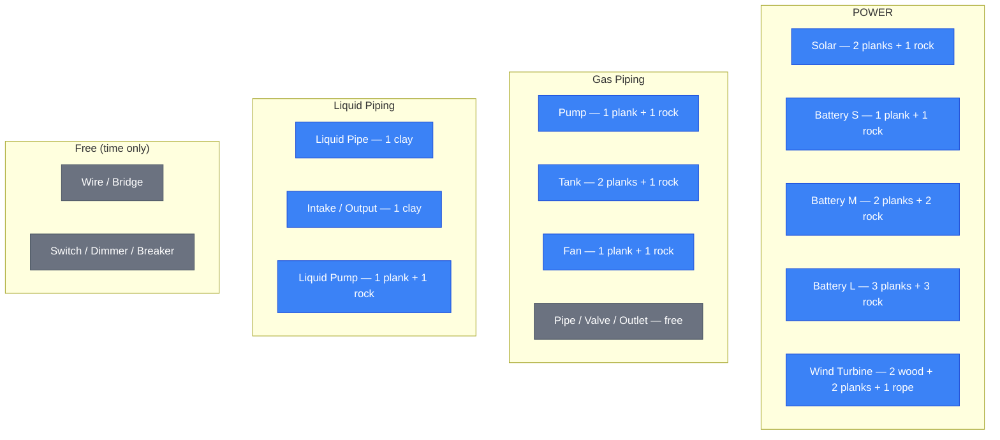

# Crafting & Building Dependency Tree

## Resource Gathering

## Crafting Recipes

## First Night Survival (8-10 min)

## Day 2+ Expansion

## Building: Structure

## Building: Utilities & Lighting

```mermaid
graph TD
    subgraph UTILITIES
        WL["Well — 3 wood + 2 rock + 1 rope"]
        FP["Campfire — 1 wood"]
        CP["Compost — 1 wood"]
        CN["Cannon — 6 rock"]
    end
    subgraph LIGHTING
        WT["Wall Torch — 1 wood"]
        FL["Floor Lamp — 1 plank"]
        CL["Ceiling Light — 1 plank"]
        WL2["Wall Lamp — 1 plank"]
        FD["Floodlight — 2 rock"]
        TL["Table Lamp — free"]
    end

    classDef item fill:#3b82f6,stroke:#1d4ed8,color:#fff
    classDef free fill:#6b7280,stroke:#4b5563,color:#fff
    class WL,FP,CP,CN,WT,FL,CL,WL2,FD item
    class TL free
```

## Building: Power & Piping

