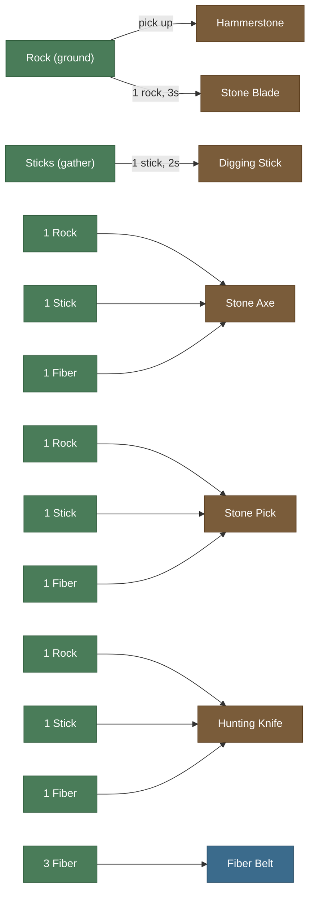
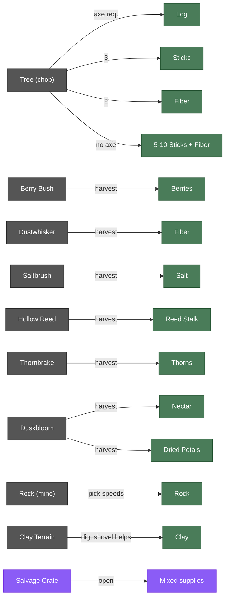
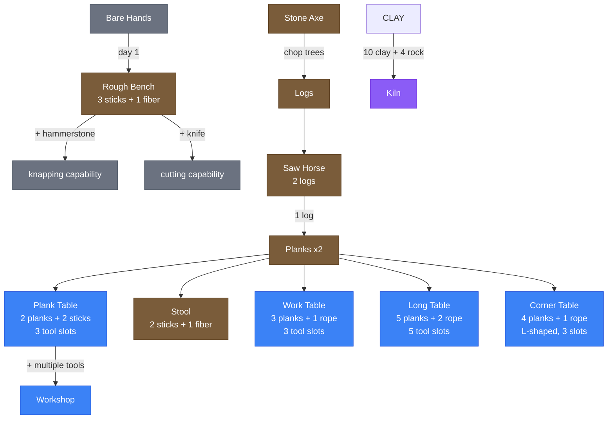
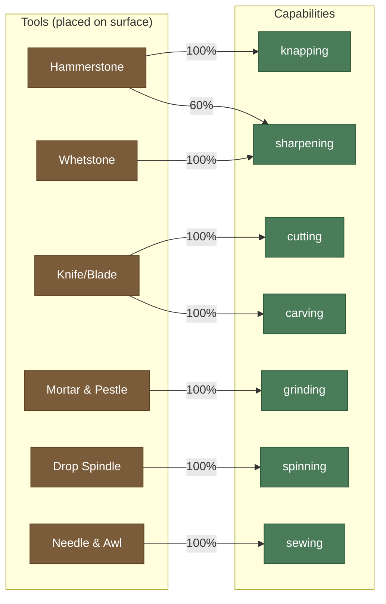
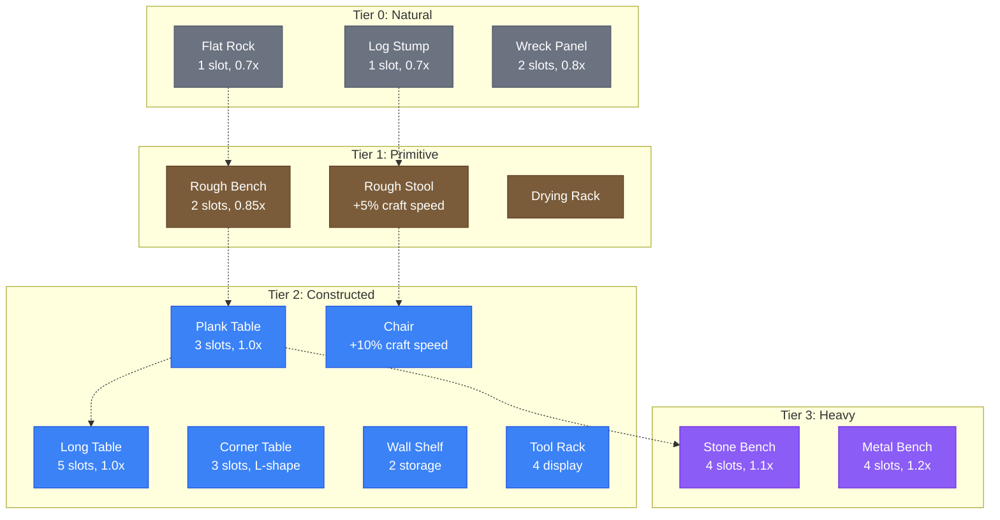
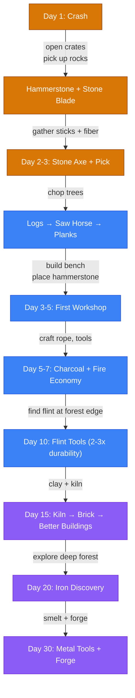
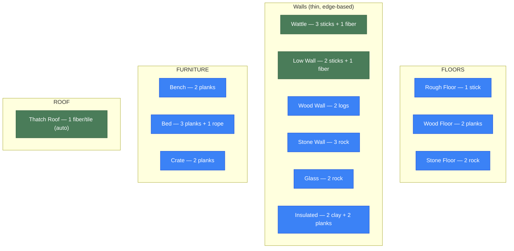
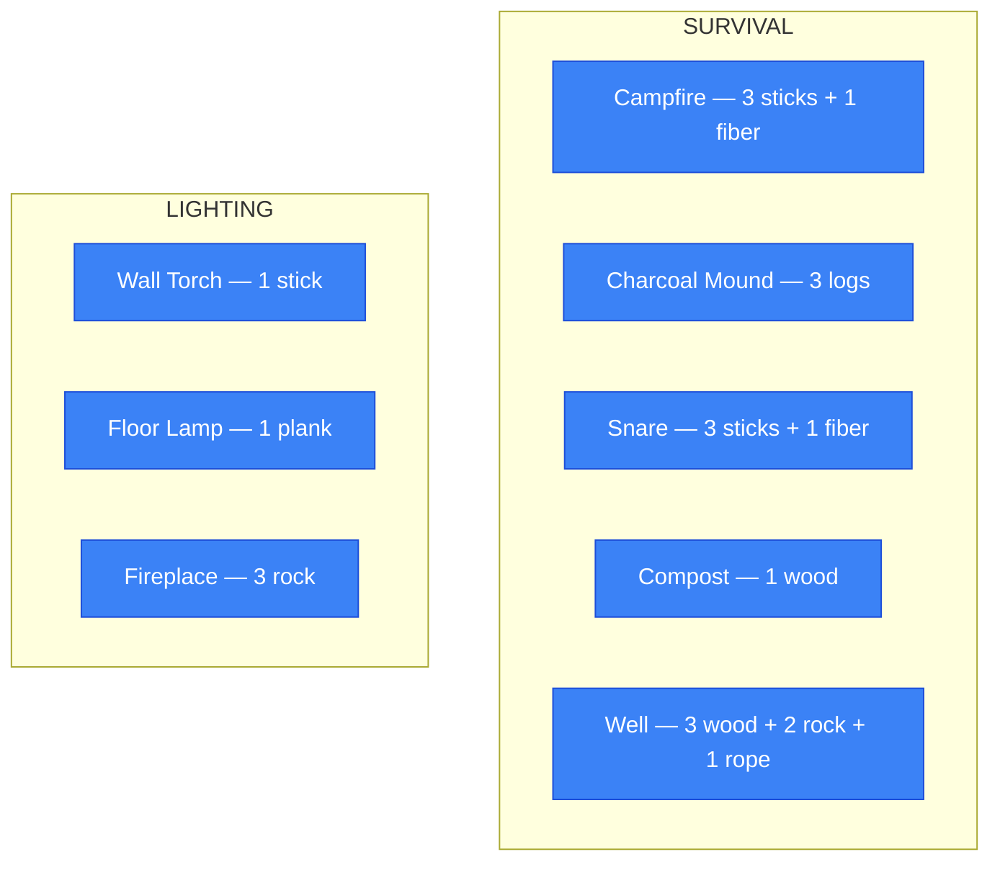

# Crafting & Building Dependency Tree

## Primitive Tool Chain (Day 1)

## Resource Gathering

## Crafting Stations Progression

## Surface + Tool = Capability

## Furniture Progression

## First 30 Days Overview

## Building: Structure

## Building: Survival & Light

